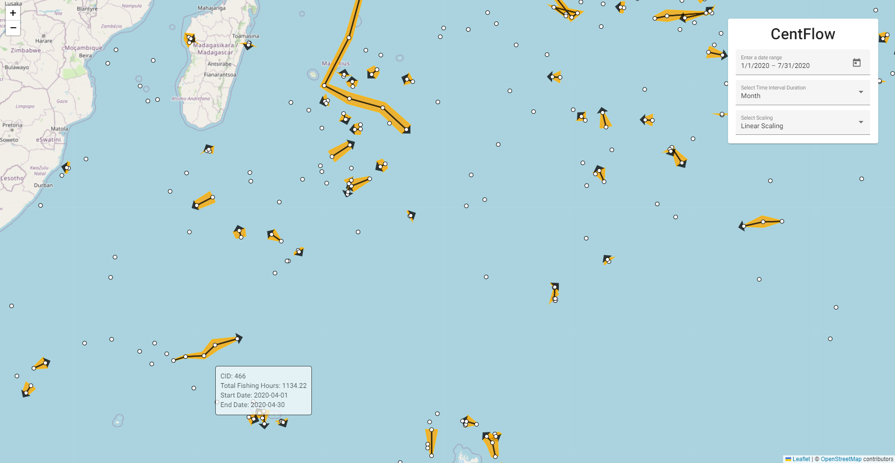
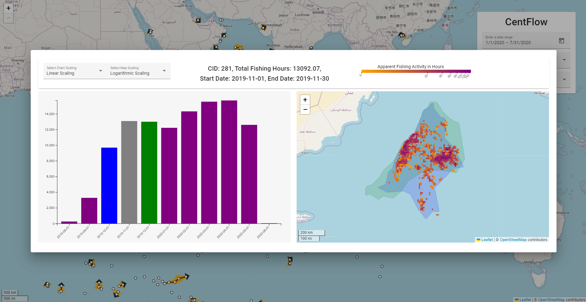

# CentFlow
CentFlow, a visual exploration tool for identifying fishing activity trends from spatio-temporal raster data. CentFlow uses path-like trajectory glyphs to represent the overall movement of fishing activity clusters, identifying trends and providing an overview of fishing activity over wide time periods. Furthermore, CentFlow provides detailed insights into the changes in the spatial characteristics of individual clusters. CentFlow enables these insights to be explored by representing localized fishing activity through colored tiles alongside silhouettes of neighboring time steps for individual clusters. CentFlow can thereby depict the movement of numerous clusters spanning a wide time range without compromising important details about cluster movements or characteristics. 

A memory efficient variation of the ST_DBSCAN algorithm for clustering large spatio-temporal data sets was used for this visualization system. This memory efficient approach enables larger time frames to be clustered, thereby expanding the scope of information to be gained. 




The overview map shows the movement trends of clusters by taking the centroid of each cluster at given time steps and mapping these to a trajectory glyph. The width of the glyph at a given time step (time steps are represented by a white circle) indicates the amount of fishing activity that occurs within that time step relative to other time steps of the same cluster. Thereby, a trend in the amount of fishing activity that occurs within a cluster can be seen by viewing its trajectory glyph. Clusters, for which only a single time interval exists, are represented by a single circle. Hovering over a circle with a mouse reveals a tooltip with information about the cluster ID, starting date and end date of the viewed time step of the cluster. Clicking on a time step (white circle) brings up the cluster view. 




Clicking on a bar in the bar chart, visualizes the cluster on the cluster map for the time step that the bar represents. Information about the currently selected time step is displayed at the top of the view. The total area covered by the colored raster tiles on the map show the size and shape of the current cluster, with each tile representing an area of ~121km<sup>2</sup> (0.1 decimal degrees per side). Tiles are colored based on the number of hours of fishing activity that occurred at the tile's location for the duration of the time step. A legend, in the top right of the view, indicates the amount of fishing activity each color represents. Clicking on a tile opens a tooltip with additional details about the location and the amount of fishing activity that occurs within the region that the tile represents. Together, these tiles show the shape of the cluster and provide insight about the amount of fishing activity that occurs within the cluster. The blue and green polygons, seen on the cluster map, represent the convex hulls of the cluster in the respective previous and next time steps. 


## Spatio-Temporal Clustering

A very slow implementation of spatio-temporal DBSCAN that focuses on memory efficiency instead of speed. This is done by replacing the typically used adjacency matrix with raw computation. This approach is useful for clustering extremely large data sets with over 1.5 million data points that cannot be clustered using traditional methods due to the lack of sufficient physical memory that can be fitted in single server. This algorithm was based on the work of E. Cakmak on [spatio-temporal clustering](https://github.com/eren-ck/st_dbscan).


```
def st_dbscan(data, eps1, eps2, min_points):
    labels = [None] * len(data)         # initializing an empty label array
    c = -1                              # initialize cluster counter
    for p in data:                      # iterating over every point in the cluster
        i = int(p[3])                   # index of the current point
        if labels[i] is not None:       # determine if p has been processed
            continue
        N = spatialNeighbors(temporalNeighbors(data, eps2, p), eps1, p) # neighborhood
        if len(N) < min_points:         # determine neighborhood size meets min_points
            labels[i] = -1              # label point as noise
            continue
        c += 1                          # start next cluster
        labels[i] = c                   # set cluster label to this node
        S = N[N[:, 3] != p[3]].tolist() # S := N \ {P}
        while S:
            elem = S.pop()
            j = int(elem[3])            # get index of q in Data
            if labels[j] == -1:         # relabel noise point as neighbor
                labels[j] = c
            if labels[j] is not None:   # skip previously processed point
                continue
            labels[j] = c               # label current point
            N = spatialNeighbors(temporalNeighbors(data, eps2, elem), eps1, elem)
            if len(N) < min_points:
                continue
            # S = S union N
            S.extend(N)
    return np.array(labels)


def spatialNeighbors(data, eps, q):
    return data[np.sqrt(np.square(data[:, 1] - q[1]) + np.square(data[:, 2] - q[2])) <= eps]

def temporalNeighbors(data, eps, q):
    return data[abs(data[:, 0] - q[0]) < eps] 
```

## Architecture 

| Technology | Description |
| -----------|-------------|
| Frontend | |
| Angular | Application design framework |
| Typescript | Statically typed, high level programming language |
| HTML5 | Markup language used for creating web pages |
| SASS | Powerful styling language |
| D3 | A JS/TS library for structuring DOM elements for the purpose of creating visualizations |
| RxJS | A JS/TS library for reactive programming using callback functions and Observables |
| Leaflet | A JS/TS library for building web maps |
| Backend | |
| Python | High level programming language with simple syntax |
| Flask | Python based web framework |
| Psycopg2 | PostgreSQL database adapter for python |
| Docker | Containerized application management system |
| Database | |
| PostgreSQL | Open source relational database system |
| PostGIS | PostgreSQL extension that specializes in geographic functions |